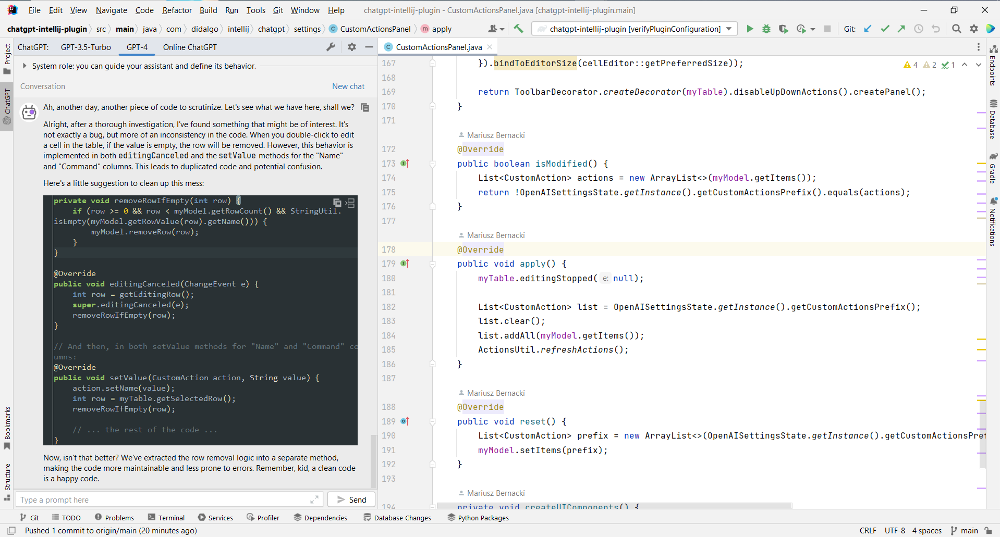
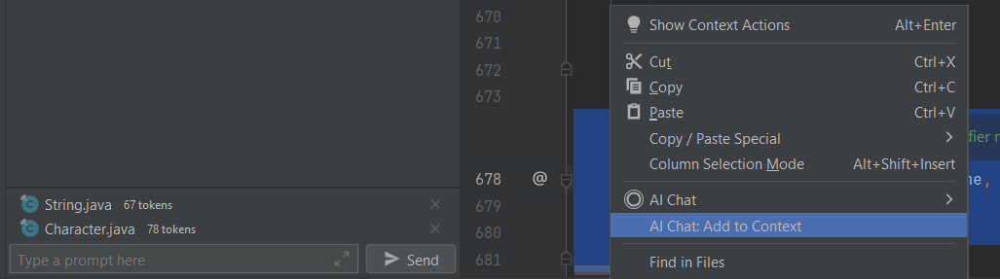

# ChatGPT Integration
Yet another JetBrains extension that allows you to use ChatGPT inside your favourite IDE

### About this project

This project is a plugin that provides integration with OpenAI ChatGPT API to run on JetBrains IDEs, providing developers with a powerful tools.

## Features

Code generation, code interaction, contexts and others.

- [x] Ask ChatGPT (supports multiple models)
- [x] Vision support; directly paste screenshots or images into the prompt field
- [x] Azure OpenAI endpoints support
- [x] Claude 3, Gemini 1.5, and Ollama models support
- [x] Select a code fragment in the editor and Ask ChatGPT (selected code will be automatically appended to the prompt)
- [x] One-click copy code from ChatGPT's answer back to the editor
- [x] Count tokens in the open file or selection
- [x] Custom Actions from prompts
- [x] Context snippets, with possibility to attach multiple files, selections, or contents of documentation popups to the prompt
- [x] Password-Safe storage of API keys

### Screenshots

## Getting Started

To use the extension, you must have a JetBrains IDE installed and configure the API key, which can be found in your [User Settings](https://platform.openai.com/account/api-keys).
The plugin is available for installation from [JetBrains Marketplace](https://plugins.jetbrains.com/plugin/21953-chatgpt-integration).
To add more model providers such as Claude, Gemini, Ollama, or Azure OpenAI, go to *File -> Settings -> Tools -> ChatGPT Integration* and review the available configurations.

## Contribution

Reach out to us, if you're interested in contribution.

## Privacy Policy

The plugin does not transmit any information or conversation messages to third-party servers. All chat message exchanges occur directly between the local PC where the plugin is installed and the model provider servers.

## License

This project is licensed under the Apache License, Version 2.0 (the "License"); you may not use this project except in compliance with the License.

## Disclaimers

This plugin is provided as-is, without any official support or endorsement from OpenAI nor any other model providers. The author of this plugin shall not be liable for any damages caused by its use.
